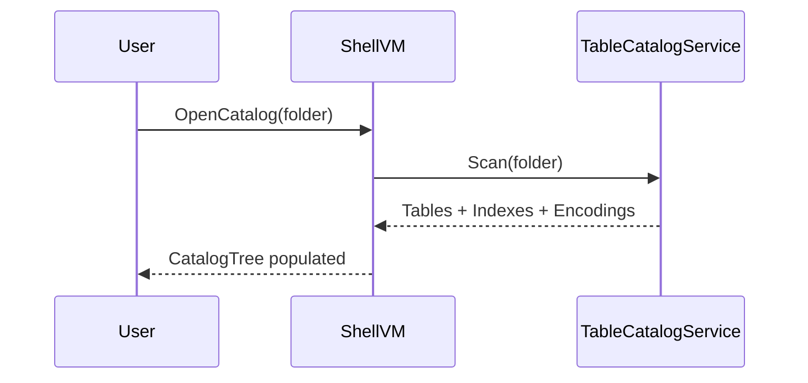
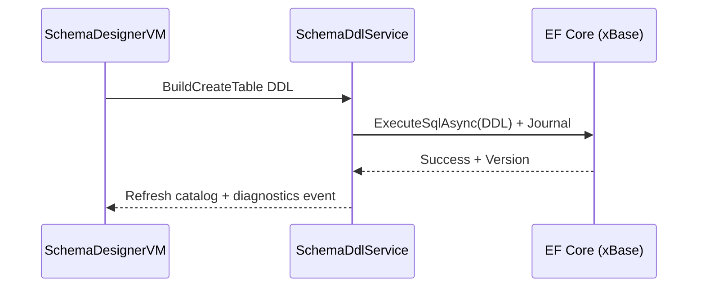
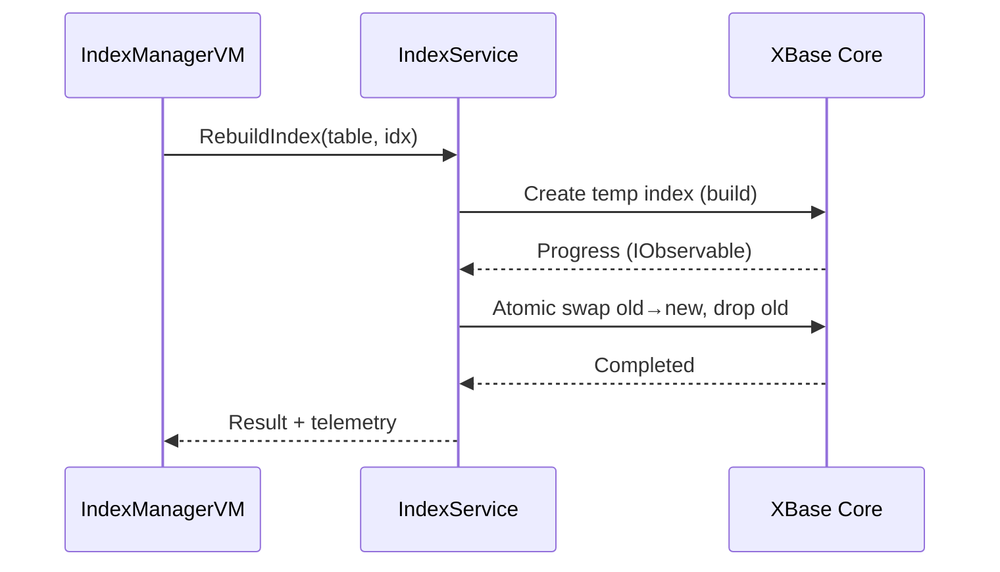

# xBase .NET Demo Solution Blueprint

## Objective & Scope
- **Goal:** Deliver a cross-platform desktop demonstration for xBase .NET Phase A capabilities using Avalonia 11 and ReactiveUI.
- **Focus Areas:**
  - Runtime schema management (CREATE/ALTER/DROP).
  - Index lifecycle orchestration (build/swap/rebuild).
  - Data browsing, filtering, and CRUD operations with DBF/DBT stores.
  - Journaling, locking visibility, and performance diagnostics.
  - CSV-based seeding with selectable code pages.
  - Crash-safe write pipeline with simulated failure and recovery.

## Architectural Overview
```mermaid
flowchart LR
  UI[ Avalonia Views ] -- bindings --> VM[ ReactiveUI ViewModels ]
  VM -- ICommands/Observables --> AppSvc[ Application Services ]
  AppSvc -- DbContextFactory --> EFCore[ EF Core (UseXBase) ]
  AppSvc -- ADO.NET ops --> XBaseCore[ xBase Core (journal, locks, indexes) ]
  EFCore <--> FS[(DBF/DBT, NTX/MDX, sidecar)]
  AppSvc -- Logging/Diag --> Diag[ Diagnostics & Telemetry Sink ]
  AppSvc -- FilePicker --> OS[OS dialogs]
```

## Functional Scenarios
1. **Catalog Bootstrap**
   - Select directory, auto-discover tables, indexes, encodings.
2. **Table Design & DDL Transactions**
   - Create tables, add/alter/rename columns, drop tables with transactional guard.
3. **Index Lifecycle Management**
   - Create expression indexes (e.g., `UPPER(NAME)`), drop, rebuild side-by-side.
4. **Data Exploration**
   - Paginated grid with column sorting, index-aware filtering, toggle deleted rows.
5. **CRUD Operations**
   - Add/edit/delete records with RECNO and shadow keys support.
6. **Diagnostics & Journaling**
   - Monitor journal state, recent operations, file locks, encoding, scan vs. seek metrics.
7. **Import & Seed**
   - CSV import with encoding detection/override.
8. **Crash-Safe Workflow**
   - Simulate failure and demonstrate recovery replay.

## Solution Layout
```
xBase.Demo/
 ├─ src/
 │   ├─ XBase.Demo.App            (Avalonia + ReactiveUI desktop host)
 │   ├─ XBase.Demo.Domain         (EF entities, DTOs, configurations)
 │   ├─ XBase.Demo.Infrastructure (DbContext, services, adapters)
 │   └─ XBase.Demo.Diagnostics    (logging, telemetry, event streams)
 ├─ tests/
 │   ├─ XBase.Demo.App.Tests      (ViewModel commands, navigation)
 │   └─ XBase.Demo.Infra.Tests    (DDL/Index services with fake FS)
 ├─ assets/                       (icons, sample catalogs, CSV seed)
 └─ tools/                        (dev scripts, fixture generators)
```

## Key Components & Responsibilities
### Views (Avalonia)
- **ShellView:** Hosts navigation tree and tabbed workspaces.
- **TableBrowserView:** DataGrid with paging, sorting, quick filters, index selector.
- **SchemaDesignerView:** Column list editor, type picker, DDL preview (Up/Down).
- **IndexManagerView:** Index list, create/drop/rebuild controls, expression editor.
- **DiagnosticsView:** Journal state, lock explorer, performance events.

### ViewModels (ReactiveUI)
- **ShellViewModel:** Handles catalog lifecycle (`OpenCatalog`, `CloseCatalog`, `SaveSettings`).
- **CatalogViewModel:** Loads tables/indexes, propagates selection changes.
- **TableBrowserViewModel:**
  - Inputs: `SelectedTable`, `SelectedIndex`, `SearchText`, `ShowDeleted`.
  - Commands: `AddRecord`, `EditRecord`, `DeleteRecord`, `RefreshPage`.
- **SchemaDesignerViewModel:** Commands for `CreateTable`, `AlterColumn`, `RenameColumn`, `DropTable`, `ApplyDdl`.
- **IndexManagerViewModel:** Commands for `CreateIndex`, `DropIndex`, `RebuildIndex`, `AnalyzeIndex`.
- **DiagnosticsViewModel:** Exposes `JournalEvents`, `LockEvents`, `PerfEvents` as observables.

### Services & Infrastructure
- `IDbContextFactory<XBaseDemoContext>` with `UseXBase` options (journal, locking, code page, deleted row visibility).
- `ITableCatalogService`: Directory scanning, sidecar detection, metadata caching.
- `ISchemaDdlService`: Provider-aware DDL emission for table/column operations.
- `IIndexService`: Index create/drop/rebuild with progress observables and atomic swap.
- `IQueryService`: Paged queries, index hints, scan/seek feedback.
- `IJournalService`: Commit log access, recovery state, crash simulation hooks.
- `ICsvImportService`: Typed import with encoding prompts.
- `IDialogService`: File picker, confirmations, notifications.

## Interaction Sketches
### Catalog Discovery


### Online DDL Workflow


### Side-by-Side Index Rebuild


## Data Model & EF Mapping
- Demo entities: `Product`, `Customer`, `Order`, `OrderLine`.
- dBASE type alignment: `Character (C)`, `Numeric (N)`, `Date (D)`, `Logical (L)`, `Memo (M)`.
- Monetary fields: `Numeric(12,2)`; dates via `DateOnly` conversions.
- Indexes:
  - `IDX_PRODUCTS_NAME = UPPER(NAME)`
  - `IDX_ORDERS_DATE = ORDERDATE`
- Shadow key strategy using `RECNO` when natural key absent.

## Configuration Profiles
- **dev:** Show deleted rows, automatic code page detection.
- **demo:** Journaling enabled, file-level locking.
- **perf:** Diagnostics disabled for throughput.
- Maintain MRU catalog paths, override encodings per catalog.

## UX & Resilience Decisions
- DDL preview panel with reversible Up/Down script before apply.
- Conflict handling with retry/exclusive options when files locked.
- Long-running operations expose progress, cancel request, and journal entries.

## Diagnostics & Telemetry
- Event feed: `JournalCommitted`, `IndexSwap`, `RecoveryApplied`, `LockWait`, `ScanVsSeek`.
- Export diagnostic reports as JSON/CSV for reproduction.
- Crash test toggle to simulate post-write failure.

## Build & Release Tracks
- Publish self-contained profiles (`win-x64`, `linux-x64`, `osx-x64/arm64`).
- Store app settings under platform-conventional paths (XDG, LocalAppData).
- Optional code signing; display Apache-2.0 license within app.

## Testing Strategy
- ViewModel tests with `ReactiveUnitTestScheduler` for deterministic async flows.
- Infrastructure tests using fake filesystem and temp directories for DDL/index services.
- End-to-end smoke: Avalonia.HeadlessRunner covering seed → DDL → CRUD → reindex → recovery.

## Sample Assets
- `RetailMini/`: Products, Orders, Customers with NTX indexes.
- `EmptyLab/`: Clean catalog for live DDL.
- Seed CSVs with varied encodings (CP852, UTF-8).
- "1-Click Demo" script: open catalog → seed → build index → query.

## Milestones & Acceptance Criteria
- **M1 – App shell & catalog browser:** Scan/open catalog, list tables/indexes, paged grid, deleted toggle.
- **M2 – DDL & index basics:** Table create/alter/drop, index create/drop, DDL preview, surfaced errors.
- **M3 – Rebuild & diagnostics:** Side-by-side rebuild with progress, performance indicators, index selection feedback.
- **M4 – Seed & recovery demo:** CSV import with encoding selection, crash simulation and recovery report.

## Risks & Mitigations
- Long rebuilds: background processing, throttled UI updates, cancel hooks.
- Encoding anomalies: preview samples, explicit override per import.
- File locking: diagnostics panel visibility, retry policy guidance.

## Next Steps
1. Scaffold solution skeleton and dependency injection wiring (M1).
2. Implement catalog scanning and table browser foundation (M1).
3. Add DDL/index services with preview workflows (M2).
4. Deliver rebuild diagnostics feed (M3).
5. Integrate seed/import and recovery simulation (M4).
